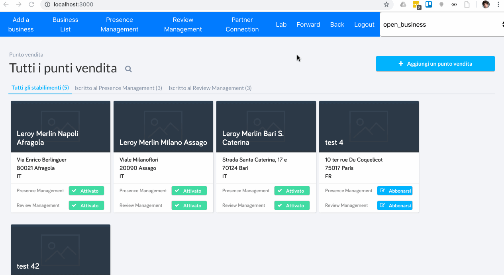

# PARTOO JS API Integration example

This repo is meant to demonstrate how to integrate Partoo JS API on a single Page application.

This project was bootstrapped with [Create React App](https://github.com/facebook/create-react-app).

## APIs documentation

Partoo APIs documentation can be found here:

- [REST API](https://doc.partoo.fr/)[https://doc.partoo.fr/rest_api/index.html]
- [JS API](https://doc.partoo.fr/)[https://doc.partoo.fr/js_api/index.html]

## Prerequisite

Ask your account manager to give you an access to partoo sandbox environments:

- [Partoo](https://sandbox.partoo.co/app)
- [Localoo](https://sandbox.localoo.es/app)

## Installing the project

```bash
# if you are using yarn
yarn install
# if you are using npm
npm install
```

## Running the project

```bash
# if you are using yarn
yarn start
# if you are using npm
npm start
```


